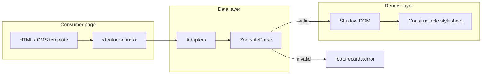

# Architecture

*Why* `<feature-cards>` is built the way it is — the engineering story behind
the brief. Formal decision records live in [`docs/adr/`](docs/adr/); narrative
diagrams in [`docs/diagrams/`](docs/diagrams/architecture.md). For field-level
JSON details see [`docs/SCHEMA.md`](docs/SCHEMA.md).

## Table of contents

- [The problem](#the-problem)
- [System overview](#system-overview)
- [Why a Custom Element](#why-a-custom-element-and-not-a-framework-component)
- [Why Shadow DOM](#why-shadow-dom)
- [Why schema + adapters](#why-schema--adapters)
- [Progressive enhancement](#progressive-enhancement)
- [Responsiveness without media queries](#responsiveness-without-media-queries)
- [TypeScript in, vanilla JS out](#authored-in-typescript-shipped-as-vanilla-js)
- [Error model](#error-model)
- [Build & deploy topology](#build--deploy-topology)
- [Demo layers (not npm API)](#demo-layers-not-npm-api)
- [Trade-offs rejected](#trade-offs-considered-and-rejected)
- [Licensing & provenance](#licensing--provenance)

## The problem

Replace three hard-coded feature-card **images** with something that is:

| Requirement | Architectural response |
| --- | --- |
| Reusable | One Custom Element, many embed contexts |
| Accessible | Semantic DOM, axe gate, keyboard-native links |
| Responsive | Container queries + grid auto-fit |
| CMS-agnostic | Canonical schema + tiny adapters |
| Minimal adjustment | Script tag or single ESM import |
| Native APIs | No framework runtime in shipped bundle |

## System overview



Data enters from four sources (documented precedence), passes through optional
adapters, validates once, then renders exactly one internal template.

## Why a Custom Element (and not a framework component)

A React/Vue/Svelte component is the right tool **inside** that framework's app.
It is the wrong tool for a WordPress PHP theme, a Shopify liquid section, or a
legacy .NET portal that will never adopt a SPA toolchain.

A **native Custom Element**:

- Registers with `customElements.define` — no reconciler, no virtual DOM
- Ships as ESM + IIFE (~24 KiB gzip)
- Upgrades existing HTML (`<feature-cards>` already in the document)
- Degrades to plain links when JS is absent or fails

Optional `@humza/feature-cards/react` exists for teams that *want* React — the
core does not *require* it. (ADR-0001)

## Why Shadow DOM

CMS pages arrive with unknown global CSS: resets, utilities, `!important`
rules, theme frameworks. Light-DOM widgets routinely break in both directions
(host breaks widget, widget breaks host).

**Open Shadow DOM** gives:

- Hard encapsulation for internal structure and class names
- A deliberate **public styling API**: `--fc-*` custom properties + `::part()`
- Preserved light-DOM children via `<slot>` (progressive enhancement)
- Inspectability for tests, axe, and debugging (`mode: 'open'`)

Iframe embedding was rejected: SEO, heading outline, theming, and container
layout all suffer. (ADR-0002)

## Why schema + adapters

"CMS-agnostic" is primarily a **data** problem. WordPress REST, Contentful
Delivery, and Sanity GROQ share no natural shape.

The split:

```
CMS payload  →  adapter (pure fn)  →  FeatureCardsData  →  renderer
```

- **One canonical schema** — `src/schema.ts`, Zod-validated, typed exports
- **Adapters** — ~40-line mappers in `src/adapters/`
- **Registry** — `adapter` attribute selects mapper (`getAdapter`)
- **generic** — pass-through normaliser for JSON already shaped correctly

The renderer never imports CMS-specific code. Adding WordPress was one adapter;
adding Contentful was another — the element did not change. (ADR-0003)

## Progressive enhancement

The element accepts plain `<a>` children. Before JavaScript:

- Links render and navigate normally
- No broken layout from empty custom tags (slot content visible)

After upgrade:

- Light DOM parsed into card data OR remote/inline JSON renders the full UI
- Invalid data **never destroys** fallback content
- Errors surface as events, not thrown exceptions

### Data precedence (highest wins)

1. `element.data` property
2. Inline `<script type="application/json">`
3. `src` fetch + adapter
4. Default slot anchors

Document this order when debugging integration issues —
[`docs/TROUBLESHOOTING.md`](docs/TROUBLESHOOTING.md).

## Responsiveness without media queries

The component cannot assume viewport context. It may sit in:

- A full-width marketing band
- A 280px sidebar widget
- A resizable demo panel

Therefore:

- `container-type: inline-size` on `:host`
- `@container` rules for spacing and heading rhythm
- `grid-template-columns: repeat(auto-fit, minmax(min(var(--fc-card-min), 100%), 1fr))`
- `clamp()` for fluid typography
- Optional `columns` attribute (1–6) to cap tracks when layout demands it

Verified by e2e resize test against `#resizable-instance`, not viewport emulation.
(ADR-0005)

## Authored in TypeScript, shipped as vanilla JS

Strict compiler flags (`exactOptionalPropertyTypes`, `noUncheckedIndexedAccess`)
keep adapter and schema code honest. Consumers get `.d.ts` declarations.

Shipped artefacts:

| File | Role |
| --- | --- |
| `dist/feature-cards.js` | ESM entry |
| `dist/feature-cards.iife.js` | Script tag / CDN |
| `dist/react.js` | Optional React wrapper |
| `dist/types/` | TypeScript declarations |

**Zod** is the sole bundled runtime dependency — it earns its ~12 KiB gzip by
powering validation, typed inference, and structured error paths.

## Error model

Bad data is a normal operating condition (CMS misconfiguration, stale cache,
editor mistake). The component:

1. Runs `safeParseFeatureCardsData`
2. On failure, emits `featurecards:error` with `{ issues, problem }`
3. Keeps shadow slot visible so light-DOM fallback remains
4. Never throws to embedding pages

`ProblemDetail` follows RFC 7807-style fields for tooling compatibility
(`src/errors.ts`).

## Build & deploy topology

```
┌─────────────────────────────────────────────────────────────┐
│  src/*.ts                                                    │
│    vite lib build → dist/feature-cards.{js,iife.js}         │
│    tsc -p build   → dist/types/                             │
│    generate-cem   → custom-elements.json                    │
├─────────────────────────────────────────────────────────────┤
│  demo/  → vite demo build → dist/demo/  → Cloudflare Pages  │
│  worker/ → wrangler deploy  → mock CMS   → Cloudflare Worker │
└─────────────────────────────────────────────────────────────┘
```

| Surface | URL | Branch trigger |
| --- | --- | --- |
| Demo | `501fun.humza-butt.space` | push to `master` |
| Mock CMS | `cms.501fun.humza-butt.space` | push to `master` |
| npm | `@humza/feature-cards` | tag `v*.*.*` |

Size budget enforced by `npm run size` (24 KiB gzip ESM ceiling).

## Demo layers (not npm API)

The demo landing page adds **page chrome** that is deliberately excluded from
the published package:

| Layer | Location | Purpose |
| --- | --- | --- |
| Page themes | `demo/themes/` | 12 parody `--page-*` token sets + picker |
| Page motion | `demo/motion/` | Scroll reveal, theme flash, validation pulses |
| Schema playground | `demo/main.ts` | Live JSON editor |

Component motion tokens (`--fc-transition`) ship in `src/styles.ts`; demo-only
motion does not. See [ADR-0006](docs/adr/0006-page-themes-and-motion.md) and
[`docs/DEMO.md`](docs/DEMO.md).

## Trade-offs considered and rejected

| Option | Why rejected |
| --- | --- |
| Framework component (+ per-framework wrappers) | Couples consumers to a runtime; fails "any CMS". |
| Lit / Stencil | Excellent tools; runtime/compiler contradicts zero-dependency brief at this scale. |
| Light-DOM rendering | Style collisions in arbitrary CMS pages — the failure mode we must avoid. |
| iframe embed | Isolation at the cost of SEO, a11y context, theming, container layout. |
| Hand-rolled validation | Loses typed inference and structured errors; false economy on bytes. |
| Viewport media queries | Wrong axis — embeddable components respond to **container** width. |
| Runtime CSS-in-JS | No framework runtime policy; constructable stylesheets are native and fast. |

## Licensing & provenance

**AGPL-3.0-only** with inert authorship markers (canary watermark) in shipped
bundles and rendered output. Network use of modified versions triggers source
offer obligations; markers make provenance verifiable without tracking users.

Details: [SECURITY.md](SECURITY.md), [ADR-0004](docs/adr/0004-agpl-licence.md).

---

**Next reads:** [docs/README.md](docs/README.md) · [SCHEMA.md](docs/SCHEMA.md) ·
[ACCESSIBILITY.md](ACCESSIBILITY.md)
