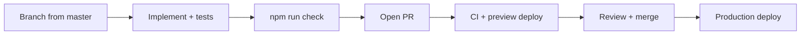

# Contributing

Thank you for helping improve `<feature-cards>`. This project is deliberately
small, opinionated, and quality-gated — the rules below keep it that way.

**Start here:** [docs/README.md](docs/README.md) for the full documentation map.

## Ground rules (non-negotiable)

| Rule | Why |
| --- | --- |
| **Zero runtime dependencies** in shipped code | Zod is the single bundled exception — schema story depends on it |
| **No frameworks** in the core bundle | Native Web Component positioning (ADR-0001) |
| **Accessibility regressions block release** | axe zero violations; full keyboard operation |
| **Never throw at consumers** | Emit `featurecards:error`; preserve light DOM |
| **Canary watermark is load-bearing** | Do not remove or alter `src/watermark.ts` |
| **AGPL header on every source file** | Legal consistency — enforced by `npm run license:check` |

## Getting started

```sh
git clone https://github.com/Hum2a/feature-cards
cd feature-cards
npm run setup     # env templates, npm ci, rules sync, Playwright, build:lib, doctor
npm run dev       # demo → http://localhost:5173
npm run serve:cms # mock CMS → http://localhost:8787/api/cards (second terminal)
```

`npm run setup:quick` skips Playwright browsers and `build:lib` when you only need
deps and env files. Run full `npm run setup` before `npm run check`.

Requires **Node 22.12+** (see `.nvmrc`).

## Development workflow



See [docs/BRANCHING.md](docs/BRANCHING.md) for branch naming and hygiene.

## Before you open a PR

### Required

1. **`npm run check`** — typecheck, lint, format, full test chain, size budget
2. **Tests for new public behaviour** — unit minimum; e2e/a11y when UI changes
3. **Docs for API changes** — README API table + JSDoc on public exports
4. **Licence headers** on new files

### When markup or visuals change

- **`npm run test:a11y`** must stay at zero axe violations
- **Visual baselines** — update intentionally on **Chromium** only:
  ```sh
  npx playwright test tests/visual --update-snapshots
  ```
  (WebKit skips visual tests)

### When demo UI changes

Follow agent rules (source of truth in `.cursor/rules/`):

| Rule | Topic |
| --- | --- |
| `47-page-themes.mdc` | Full `--page-*` token blocks per theme |
| `48-page-motion.mdc` | Motion + reduced-motion requirements |
| `46-demo-page.mdc` | Demo structure and UX |

After editing Cursor rules:

```sh
npm run rules:sync
npm run rules:sync:check   # same as CI
```

## PR checklist

Use the [pull request template](.github/PULL_REQUEST_TEMPLATE.md). At minimum:

- [ ] `npm run check` passes locally
- [ ] New public behaviour has unit tests
- [ ] axe stays green for rendered markup changes
- [ ] Visual snapshots updated intentionally (if applicable)
- [ ] README / docs updated for public API changes
- [ ] Demo UI follows rules 46–48 (if applicable)
- [ ] No new runtime dependencies
- [ ] Licence headers on new files

## Commit style

[Conventional Commits](https://www.conventionalcommits.org/):

```
feat: add shopify adapter
fix: preserve slot when src fetch fails
docs: expand wordpress cookbook
test(e2e): cover theme picker persistence
chore(deps): patch vitest
```

- Subject ≤ ~72 characters
- Body explains **why** when not obvious
- Reference issues when applicable

## Code review expectations

Reviewers check:

1. Scope — does the PR do one thing well?
2. Schema/adapters — pure functions, no CMS logic in the element
3. a11y — semantics, focus, motion preferences
4. Tests — meaningful assertions, not implementation lock-in
5. Bundle size — `npm run size` if dependencies or render path changed

## Releasing (maintainers)

Full playbook: [docs/RELEASE.md](docs/RELEASE.md).

```sh
npm run release:current
npm run release -- --patch    # or --minor / --major
npm run release -- --patch --publish
```

Before tagging:

1. `npm run build:lib` + `npm run cem:check`
2. `npm run sri` — update cookbook if IIFE changed
3. `npm run check`

Stable `v*.*.*` tags → npm publish via `publish-npm.yml` (trusted publishing or `NPM_TOKEN`).

## Documentation contributions

Docs live in repo root and `docs/`. When changing behaviour, update:

| Area | Files |
| --- | --- |
| Public API | `README.md`, JSDoc, `docs/SCHEMA.md` |
| Architecture | `ARCHITECTURE.md`, relevant ADR |
| Integration | `docs/cookbook/*.md` |
| a11y | `ACCESSIBILITY.md` |
| Operations | `docs/RELEASE.md`, `docs/BRANCHING.md` |

Generated docs (`docs/api/`, `custom-elements.json`) — regenerate, don't hand-edit.

## Community

- **Questions** — [GitHub Discussions](https://github.com/Hum2a/feature-cards/discussions) or Issues
- **Bugs** — Issues with reproduction
- **Security** — email in [SECURITY.md](SECURITY.md)

## Licence

By contributing you agree your contributions are licensed under **AGPL-3.0-only**,
the project licence. See [LEGAL.md](LEGAL.md) for copyright and enforcement policy.
Do not remove or weaken licence headers, watermarks, or legal files.
