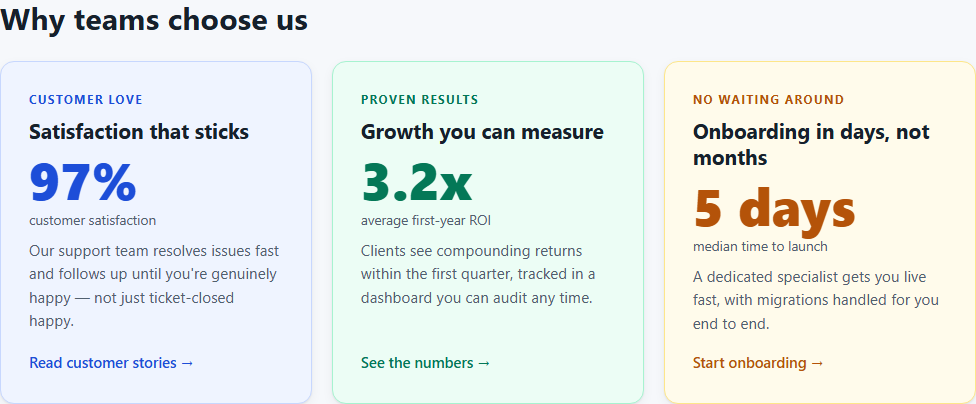

# `<feature-cards>`

[](https://github.com/humza/feature-cards/actions/workflows/ci.yml)
[](LICENSE)
[](scripts/size.mjs)
[](https://501fun.humza-butt.space)

**Package version:** `1.0.1`

**Live demo:** [501fun.humza-butt.space](https://501fun.humza-butt.space)

**One accessible, responsive, CMS-agnostic Web Component that replaces
hard-coded feature-card images.** Native browser APIs only — Shadow DOM,
container queries, constructable stylesheets — authored in strict
TypeScript, shipped as zero-framework vanilla JS.



## Quick start

**Script tag (any CMS, no build step):**

```html
<script src="https://unpkg.com/@humza/feature-cards/dist/feature-cards.iife.js" defer></script>

<feature-cards heading="Why teams choose us">
  <script type="application/json">
    {
      "cards": [
        {
          "id": "satisfaction",
          "title": "Satisfaction that sticks",
          "figure": { "value": "97%", "label": "customer satisfaction", "trend": "up" },
          "cta": { "label": "Read customer stories", "href": "/customers" },
          "theme": "brand-blue"
        }
      ]
    }
  </script>
</feature-cards>
```

**ESM:**

```js
import '@humza/feature-cards'; // registers <feature-cards>

const el = document.querySelector('feature-cards');
el.data = { cards: [{ id: 'a', title: 'Hello', cta: { label: 'Go', href: '/go' } }] };
```

**Progressive enhancement (works with JS disabled):**

```html
<feature-cards heading="From plain links">
  <a href="/docs" data-eyebrow="Guides" data-description="Integrate in an afternoon">
    Read the documentation
  </a>
</feature-cards>
```

**From a headless CMS:**

```html
<feature-cards src="https://cms.example.com/api/cards" adapter="wordpress"></feature-cards>
```

## Public API

### Attributes

| Attribute | Type | Default | Description |
| --- | --- | --- | --- |
| `src` | URL | — | JSON endpoint to fetch card data from |
| `adapter` | `generic` \| `wordpress` \| `contentful` \| `sanity` | `generic` | Mapper applied to the fetched payload |
| `columns` | `1`–`6` | auto-fit | Caps the number of grid tracks |
| `heading` | string | from data | Section heading (overrides the data's `heading`) |
| `heading-level` | `1`–`6` | `2` | Section heading level; card titles render one level deeper |
| `theme` | `brand-blue` \| `brand-green` \| `brand-amber` | — | Host-level theme (per-card `theme` in data wins) |

### Properties

| Property | Type | Description |
| --- | --- | --- |
| `data` | `FeatureCardsData \| undefined` | Set validated data directly; takes precedence over all other sources. Reads back the currently rendered data. |
| `provenance` | object (readonly) | Inert authorship record (UUID, repo, licence) |

### Events (bubble, composed)

| Event | `detail` | Fired when |
| --- | --- | --- |
| `featurecards:ready` | `{ count }` | A render completed |
| `featurecards:error` | `{ issues: { path, message }[] }` | Data was invalid or fetching failed (the component fails safe — no throw, light DOM preserved) |
| `featurecards:cardclick` | `{ id, card }` | A card was activated |

### Slots

| Slot | Purpose |
| --- | --- |
| *(default)* | Fallback content before data resolves / when data is invalid — the no-JS path |
| `heading` | Replace the generated section heading |

### CSS custom properties (theming API)

| Token | Purpose | Token | Purpose |
| --- | --- | --- | --- |
| `--fc-font` | Font stack | `--fc-card-min` | Min card track width |
| `--fc-bg` | Section background | `--fc-gap` | Grid gap |
| `--fc-fg` | Primary text | `--fc-pad` | Card padding |
| `--fc-muted` | Secondary text | `--fc-radius` | Corner radius |
| `--fc-accent` | Accent colour | `--fc-shadow` / `--fc-shadow-hover` | Elevation |
| `--fc-card-bg` | Card background | `--fc-ring` | Focus ring colour |
| `--fc-card-border` | Card border | `--fc-transition` | Motion timing |

### CSS parts

`::part(section)`, `::part(heading)`, `::part(grid)`, `::part(card)`,
`::part(link)`, `::part(eyebrow)`, `::part(title)`, `::part(description)`,
`::part(figure)`, `::part(value)`, `::part(label)`, `::part(media)`,
`::part(cta)`

```css
/* Example: restyle from outside the shadow boundary */
feature-cards { --fc-accent: rebeccapurple; --fc-radius: 4px; }
feature-cards::part(card):hover { outline: 2px solid rebeccapurple; }
```

## CMS integration

The component renders one canonical schema; **adapters** translate CMS
payloads into it. Built-ins:

```html
<!-- WordPress REST (with _embed for featured media) -->
<feature-cards src="https://site.com/wp-json/wp/v2/posts?_embed" adapter="wordpress"></feature-cards>

<!-- Contentful Delivery API -->
<feature-cards src="https://cdn.contentful.com/spaces/SPACE/entries?content_type=card" adapter="contentful"></feature-cards>

<!-- Sanity GROQ HTTP API -->
<feature-cards src="https://PROJECT.api.sanity.io/v2024-01-01/data/query/production?query=..." adapter="sanity"></feature-cards>

<!-- Anything already shaped like the schema -->
<feature-cards src="/api/cards" adapter="generic"></feature-cards>
```

A new CMS is one small pure function — see `src/adapters/wordpress.ts`
(~40 lines) and register it in `src/adapters/index.ts`.

## Accessibility

Semantic section/heading/list/link structure, configurable heading levels,
single-link cards with proper accessible names, decorative-vs-meaningful
media handling, visually-hidden trend announcements, full keyboard
operation, `prefers-reduced-motion` and `prefers-contrast` support, and an
axe-core CI gate at **zero violations**. Details: [ACCESSIBILITY.md](ACCESSIBILITY.md).

## Methodology

The short version: a native Custom Element maximises "CMS-agnostic"
(ADR-0001); Shadow DOM makes it collision-proof with theming as an explicit
API (ADR-0002); a Zod schema + tiny adapters make "minimal adjustment"
concrete (ADR-0003); AGPL + inert provenance markers protect authorship
(ADR-0004). The narrative is in [ARCHITECTURE.md](ARCHITECTURE.md); the
formal records are in [docs/adr/](docs/adr/).

## Development

```sh
npm install
npm run dev        # demo at http://localhost:5173
npm run serve:cms  # mock CMS Worker at http://localhost:8787/api/cards
npm run check      # typecheck + lint + full test chain + size budget
npm run doctor     # verify your toolchain
```

The full script deck (including `stats`, `whoami`, `ship-it`, and other
indulgences) is in `package.json`.

## Releasing

```sh
npm run release:current              # show latest tag vs HEAD
npm run release -- --patch             # bump, changelog, tag, push
npm run release -- --minor --publish   # tag + publish to npm
npm run release:package:dry            # validate without publishing
```

Stable `v*.*.*` tags pushed to GitHub trigger CI to publish
`@humza/feature-cards` to npm (requires `NPM_TOKEN` secret). See
[CONTRIBUTING.md](CONTRIBUTING.md) for the full release workflow.

## Deployment

**Production:** [https://501fun.humza-butt.space](https://501fun.humza-butt.space)

The demo (Pages) and mock CMS (Worker at `/api/cards`) deploy from CI on
push to `main`. Host settings live in [`config/site.json`](config/site.json).

| What | Where |
| --- | --- |
| Demo (Pages) | `https://501fun.humza-butt.space` |
| Mock CMS (Worker) | `https://501fun.humza-butt.space/api/cards` |

### One-time setup

1. **DNS** — In Cloudflare, ensure `501fun.humza-butt.space` is on your
   `humza-butt.space` zone (you said this is already done).
2. **GitHub secrets** — `CLOUDFLARE_API_TOKEN` and `CLOUDFLARE_ACCOUNT_ID`.
3. **API token permissions** — in addition to Pages + Workers Scripts Edit:
   - **Account → Workers Scripts → Edit**
   - **Account → Cloudflare Pages → Edit**
   - **Zone → Workers Routes → Edit** (for `humza-butt.space` — binds `/api/*` to the Worker)

On merge to `main`, CI builds the demo, deploys to the `feature-cards` Pages
project, attaches the custom domain, and deploys the Worker with route
`501fun.humza-butt.space/api/*`. PRs still get `*.pages.dev` preview URLs.

### Manual deploy

```sh
npm run build
npm run deploy
```

Verify after deploy:

```sh
npm run canary:verify -- https://501fun.humza-butt.space
```

## Licence

**AGPL-3.0-only** — © 2026 Humza Butt. See [LICENSE](LICENSE) and
[NOTICE](NOTICE).

In plain English: you can read, run, and evaluate this code freely. If you
deploy it — or a modified version — as part of a website or service, the
AGPL requires you to offer your users the complete corresponding source
under the same licence. Commercial closed-source use isn't permitted by
the AGPL; if that's what you need, contact the author about a separate
commercial licence. This repository also embeds inert authorship markers
verifiable with `npm run canary:verify -- <url>` (see
[SECURITY.md](SECURITY.md)).
