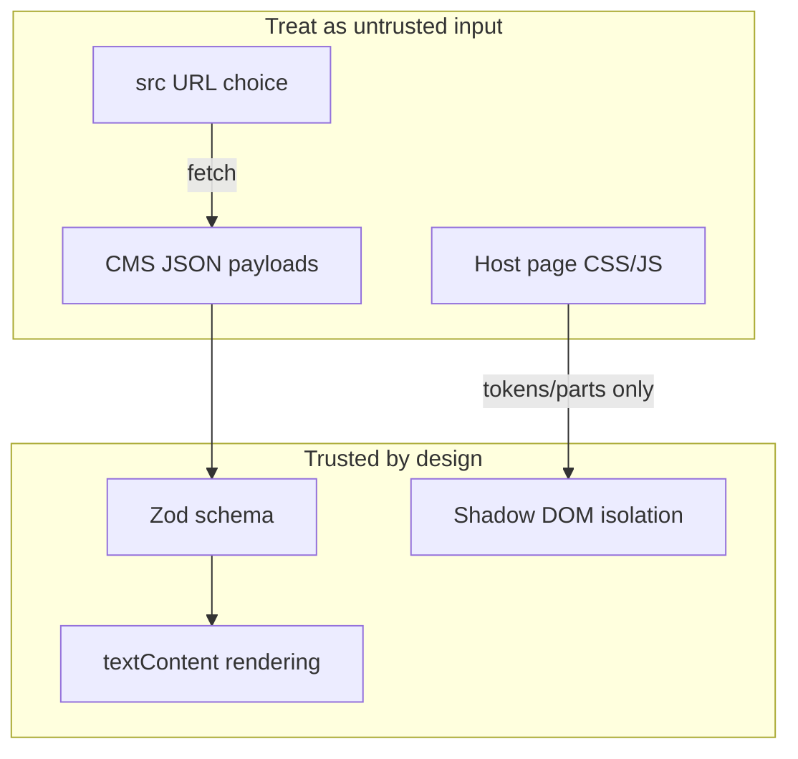

# Security

Security posture for `<feature-cards>`: threat surface, safe defaults, licensing
evidence, and how to report problems.

## Reporting a vulnerability

**Do not** open public GitHub issues for security reports.

| Channel | Detail |
| --- | --- |
| Email | **Humzab1711@hotmail.com** |
| Expected response | Acknowledgement within **72 hours** |
| Include | Description, impact, reproduction steps, affected versions |

We will coordinate disclosure and patch releases for confirmed issues.

## Threat model summary



| Asset | Risk | Mitigation |
| --- | --- | --- |
| Card text/HTML from CMS | XSS | **No `innerHTML`** with data; `textContent` only after schema validation |
| Image URLs | SSRF / tracking | Plain `` — same as any CMS image field; validate URLs at CMS layer |
| `src` endpoint | Data exfil / MITM | HTTPS; treat like any third-party JSON API |
| Host page | CSS exfil / clickjack | Shadow encapsulation; integrator CSP is their responsibility |
| npm package | Supply chain | Lockfile, CI audit (high+), npm provenance on publish |

## Input handling

1. All card fields pass through **Zod** (`safeParse` — non-throwing).
2. Render path sets **text nodes**, not HTML strings.
3. URLs (`href`, `media.src`) are validated as strings but **not** fetched server-side
   by the component — browser navigates/images load per normal web rules.
4. Invalid payloads emit `featurecards:error`; they do not partially render attacker
   controlled markup.

### Integrator responsibilities

- Serve CMS JSON from origins you trust
- Use **SRI** when loading the IIFE from CDN (`npm run sri`)
- Pin package versions (`@humza/feature-cards@1.2.x`)
- Apply **Content-Security-Policy** appropriate to your site

## Mock CMS Worker

The Cloudflare Worker at `cms.501fun.humza-butt.space` is **demo infrastructure**:

- Serves static JSON fixtures
- OpenAPI documented at `/openapi.json`
- Not intended for production content management
- CORS configured for demo origins

Do not point production sites at the demo Worker unless you accept demo data and
availability.

## Authorship & licensing (canary watermark)

Non-functional **authorship markers** prove code origin without affecting
behaviour, layout, performance, or privacy. **Nothing is collected or transmitted.**

| Marker | Location | Purpose |
| --- | --- | --- |
| Provenance constant | Bundled JS (tree-shaken reference) | UUID, repo URL, licence, timestamp |
| Zero-width signature | `data-fc-sig` on rendered section | Greppable in served HTML |
| HTML comment | Shadow root | UUID + licence string |
| Class property | `__FEATURE_CARDS_PROVENANCE__` (non-enumerable) | Runtime introspection |

### Verifying a deployment

```sh
npm run canary:verify -- https://example.com
```

The verifier:

1. Fetches page HTML (and same-origin script bundles when discoverable)
2. Scans for marker classes
3. Prints **`MATCH`** or **`NO MATCH`**
4. Performs **read-only** inspection — no callbacks, beacons, or writes

A `MATCH` indicates the site serves this **AGPL-3.0-only** codebase. Operators
of modified network-deployed versions must offer corresponding source to users
(see [NOTICE](NOTICE)).

### Maintainer notes

- UUID source: `src/watermark.ts` (`CANARY_UUID`)
- **Never remove or alter** the watermark module — see [AGENTS.md](AGENTS.md)
- Optional: rotate UUID per major release and keep a private mapping log

## Dependency security

| Control | Detail |
| --- | --- |
| `npm audit --audit-level=high` | CI (continue-on-error until toolchain majors resolved) |
| Single runtime dep | Zod only in shipped bundle |
| Major deferrals | [docs/DEPENDENCY-UPGRADES.md](docs/DEPENDENCY-UPGRADES.md) |

Report supply-chain concerns via the private email above.

## Security-related FAQ

**Does the component execute CMS HTML?**  
No — text only after validation.

**Can I disable the canary?**  
Not without violating licence and project policy. Markers are inert.

**Does fetch send cookies to arbitrary `src`?**  
Browser default credentials policy applies — same as any `fetch()` from the page.

**Is Shadow DOM a security boundary?**  
It is primarily a **style** boundary. Do not treat it as secret storage.

---

**Related:** [ADR-0004](docs/adr/0004-agpl-licence.md) · [FAQ § Licensing](docs/FAQ.md#licensing--provenance)
