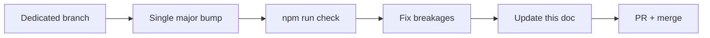

# Dependency upgrade plan

Living document for **deferred major upgrades** and **security audit** notes.
Routine patch/minor bumps land via Dependabot or manual `npm update`.

Last reviewed: **2026-06-13** · Package version: **1.2.0**

## Status dashboard

| Package | Current | Target | Priority | Status |
| --- | --- | --- | --- | --- |
| `wrangler` | 3.x | 4.x | High | Blocked — esbuild audit chain |
| `vite` | 6.x | 8.x | Medium | After vitest upgrade |
| `vitest` | 2.x | 4.x | Medium | Breaking API + coverage config |
| `zod` | 3.x | 4.x | Medium | Dependabot PR — schema review |
| `typescript` | 5.x | 6.x | Low | Wait for eslint/typescript-eslint |
| `fast-check` | 3.x | 4.x | Low | Fuzz tests only |
| `happy-dom` | 15.x | 20.x | Low | Vitest environment compat |
| `msw` | 2.7.x | latest 2.x | Routine | Patch via Dependabot |
| `react` / `react-dom` | 19.0.x | latest 19.x | Routine | Dev-only (optional peer) |

## Security: npm audit

`npm audit --audit-level=high` runs in CI with `continue-on-error: true` until
the **esbuild** advisory chain is resolved via toolchain majors (vite → vitest →
wrangler).

| Severity | Source | Notes |
| --- | --- | --- |
| High (dev) | esbuild in vite/vitest/wrangler | Dev tooling only — not in shipped bundle |
| — | Zod only runtime dep | Minimal production surface |

**Shipped bundle** contains Zod only — audit production impact separately with
`npm run size` and dependency graph review.

## Upgrade playbooks

### One major at a time

Never combine wrangler 4 + vite 8 + vitest 4 in one PR.

### Wrangler 4 (when ready)

- [ ] Read Cloudflare wrangler 4 migration guide
- [ ] Update `cloudflare/wrangler-action` if required
- [ ] Re-run deploy workflow on PR preview
- [ ] Verify Worker + Pages deploy paths
- [ ] Re-evaluate `npm audit` — expect esbuild chain improvement

### Vitest 4 + Vite 8

- [ ] Update `vitest.config.ts` for new API
- [ ] Verify coverage thresholds (`@vitest/coverage-v8`)
- [ ] Run bench suite — watch for perf regressions
- [ ] Confirm `tests/contracts` node environment still works

### Zod 4

- [ ] Review breaking changes in schema definition syntax
- [ ] Run `npm run test:fuzz` extensively
- [ ] Verify error path shapes in `featurecards:error` unchanged for consumers

## Routine maintenance

| Task | Frequency | Command |
| --- | --- | --- |
| Patch dev deps | Monthly / Dependabot | `npm update` + PR |
| Audit review | Each CI run | Check Actions logs |
| Node LTS | When `.nvmrc` bumped | `npm run doctor` |
| Lockfile integrity | Every deps PR | `npm ci` in CI |

## Process checklist (any deps PR)

1. Read changelog for breaking changes
2. `npm ci && npm run check`
3. If adapters/tests touch MSW — `npm run test:contracts`
4. If build chain changes — `npm run build:lib && npm run cem:check`
5. Update this table when merged

## Related

- [CONTRIBUTING.md](../CONTRIBUTING.md)
- [RELEASE.md](RELEASE.md)
- [SECURITY.md](../SECURITY.md)
