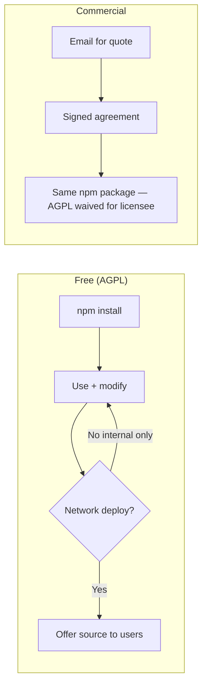

# npm package experiment — `@humza/feature-cards`

Playbook for publishing the library to npm under **AGPL-3.0-only**, with an optional
**commercial licence** path for closed-source buyers. The demo site and editor are
**not** shipped in the npm tarball.

> **Scope:** Library only (`dist/`, types, CEM, legal files). Demo → Cloudflare Pages.

## What gets published

| Included | Excluded |
| --- | --- |
| `dist/feature-cards.js` (ESM) | `dist/demo/` (demo build) |
| `dist/feature-cards.iife.js` | `demo/`, `tests/`, `worker/` |
| `dist/react.js` + `dist/types/` | Playwright snapshots, CI configs |
| `custom-elements.json` | Source `.ts` files |
| `LICENSE`, `NOTICE`, `COPYRIGHT`, legal docs | DevDependencies |

Verify locally anytime:

```sh
npm run pack:verify
```

## One-time npm account setup

### 1. Create / log in to npm

```sh
npm login
npm whoami
```

Your account must own the **`@humza` scope** (npm organisation or user scope).
If `@humza` is taken, pick another scope and update `package.json` `name` before
the first publish — renaming after consumers install is painful.

### 2. Enable 2FA (recommended)

npm → Account → **Enable 2FA** → Authorization and publishing.

For CI, use a **Granular Access Token** with **Publish** permission on
`@humza/feature-cards` only.

### 3. GitHub secret for automated publish

Repository → Settings → Secrets → Actions:

| Secret | Value |
| --- | --- |
| `NPM_TOKEN` | Granular token with publish access to `@humza/feature-cards` |

The [release workflow](../.github/workflows/release.yml) publishes stable `v*.*.*`
tags with [npm provenance](https://docs.npmjs.com/generating-provenance-statements).

### 4. npm package page (after first publish)

On [npmjs.com/package/@humza/feature-cards](https://www.npmjs.com/package/@humza/feature-cards):

- **Description** — pulled from `package.json`
- **Homepage** — demo URL
- **Repository** — GitHub link
- **License** — AGPL-3.0-only (from `package.json`)

Add a line in the README npm sees: link to [COMMERCIAL-LICENSING.md](../COMMERCIAL-LICENSING.md)
for proprietary use.

## Install (for consumers)

```sh
npm install @humza/feature-cards
```

```js
import '@humza/feature-cards';
// or
import { createFeatureCards } from '@humza/feature-cards';
import { FeatureCards } from '@humza/feature-cards/react';
```

Script tag via jsDelivr/unpkg:

```html
<script src="https://cdn.jsdelivr.net/npm/@humza/feature-cards@1.0.4/dist/feature-cards.iife.js" defer></script>
```

Pin versions in production. Run `npm run sri` after IIFE changes for integrity hashes.

## Licence model on npm



| Buyer need | Path |
| --- | --- |
| OSS / can publish source | `npm install` under AGPL — no payment |
| Evaluation / portfolio | AGPL — read repo, run demo |
| Closed SaaS / proprietary product | [Commercial licence](../COMMERCIAL-LICENSING.md) |

**Important:** There is no separate “commercial npm package” in this experiment.
Paying customers get a **signed licence** that overrides AGPL for their scope; they
still install `@humza/feature-cards` from the public registry.

## Publishing workflow

### Preflight (before every publish)

```sh
npm run doctor
npm run check
npm run pack:verify          # tarball contents + legal files
npm run release:package:dry  # full gate + npm publish --dry-run
```

### First publish (manual experiment)

```sh
# 1. Ensure version in package.json is what you want (e.g. 1.0.4)
npm run release -- --current   # or --patch if bumping

# 2. Tag must match version
git tag v1.0.4   # if not created by release script
git push origin v1.0.4

# 3. Publish (local — needs npm login)
npm run release:package

# 4. Verify
npm view @humza/feature-cards version
npm view @humza/feature-cards dist-tags
```

### Ongoing releases

```sh
npm run release -- --patch              # bump, changelog, commit, tag, push
npm run release -- --minor --publish    # tag + publish in one step (local NPM_TOKEN)
# OR push tag → GitHub Actions release workflow (NPM_TOKEN secret)
```

See [RELEASE.md](RELEASE.md) for the full checklist.

## Commercial sales + npm (dual licensing)

When a customer pays for closed-source use:

1. They still `npm install @humza/feature-cards@x.y.z` (pin the licensed version).
2. You send a [License Grant Letter](licenses/LICENSE-GRANT-LETTER.template.md)
   referencing the signed [Commercial Agreement](licenses/COMMERCIAL-LICENSE.template.md).
3. No license keys or private registry required at this stage.

**Do not grant commercial rights until:** signed agreement + payment received.

Full sales playbook: [COMMERCIAL-LICENSING.md](../COMMERCIAL-LICENSING.md).

## Troubleshooting

| Error | Fix |
| --- | --- |
| `ENEEDAUTH` | `npm login` or set `NPM_TOKEN` |
| `402 Payment Required` | Scope `@humza` may need npm org; or use unscoped name |
| `403 Forbidden` | Token lacks publish permission; 2FA token type mismatch |
| Tag ≠ package.json version | Align `v1.0.4` tag with `"version": "1.0.4"` |
| `dist/demo` in tarball | Run `npm run clean && npm run build:lib` — demo build must not run before pack |
| Provenance failed | CI needs `id-token: write` (already in release.yml) |

## Related

- [RELEASE.md](RELEASE.md) — versioning and tags
- [COMMERCIAL-LICENSING.md](../COMMERCIAL-LICENSING.md) — tiers and quotes
- [LEGAL.md](../LEGAL.md) — infringement enforcement
- [docs/licenses/](licenses/) — DRAFT contract templates for your solicitor
