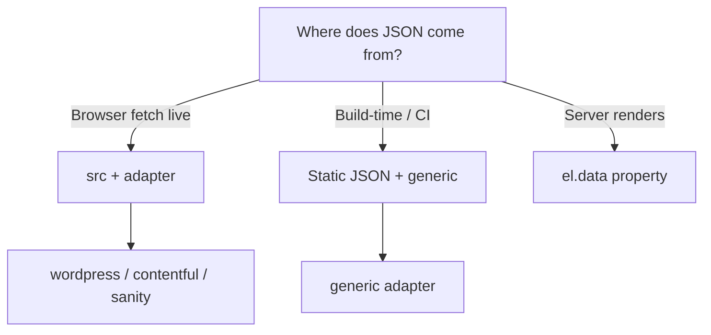

# CMS integration cookbooks

Copy-paste integration guides for common headless CMS platforms. All paths
normalise to the same canonical schema — see [SCHEMA.md](../SCHEMA.md).

| Platform | Guide | Adapter attribute | Typical `src` |
| --- | --- | --- | --- |
| **WordPress** | [wordpress.md](wordpress.md) | `wordpress` | `/wp-json/wp/v2/posts?_embed` |
| **Contentful** | [contentful.md](contentful.md) | `contentful` | Delivery API entries URL |
| **Sanity** | [sanity.md](sanity.md) | `sanity` | GROQ HTTP API or edge proxy |
| **Any JSON** | [README § CMS](../../README.md#cms-integration) | `generic` | Your static `/api/cards.json` |

## Choosing a pattern



## Shared checklist (all platforms)

- [ ] Canonical schema validated ([SCHEMA.md](../SCHEMA.md))
- [ ] `heading-level` matches page outline
- [ ] CTA links tested (whole card is one link)
- [ ] Images: meaningful `alt` or decorative `""`
- [ ] Theming via `--fc-*` if brand colours required
- [ ] Error listener for `featurecards:error` during integration
- [ ] axe spot check or `npm run test:a11y` on your page template

## Mock reference API

Development reference: [cms.501fun.humza-butt.space/api/cards](https://cms.501fun.humza-butt.space/api/cards)

OpenAPI: [openapi.json](https://cms.501fun.humza-butt.space/openapi.json) ·
[source](../openapi/cms-api.json)

```html
<feature-cards
  src="https://cms.501fun.humza-butt.space/api/cards"
  adapter="generic"
></feature-cards>
```

## Troubleshooting

[../TROUBLESHOOTING.md](../TROUBLESHOOTING.md) · [../FAQ.md](../FAQ.md)
