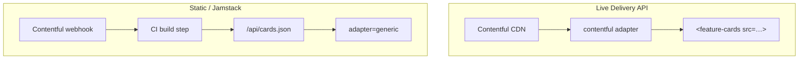
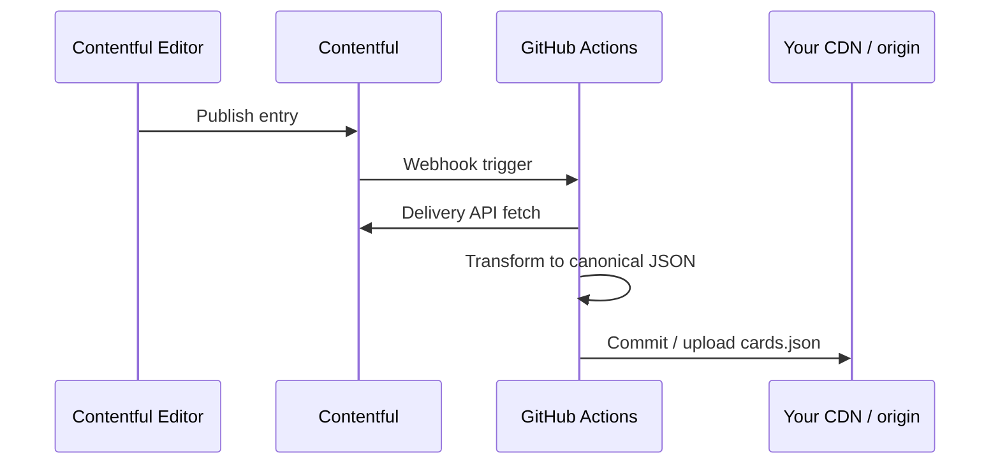

# Contentful integration cookbook

Map a Contentful content type to the canonical card schema using the built-in
**`contentful`** adapter — or pre-render static JSON for Jamstack deploys.

**Related:** [SCHEMA.md](../SCHEMA.md) · [ADR-0003](../adr/0003-schema-and-adapters.md)

## Architecture options



| Pattern | When to use |
| --- | --- |
| Live `src` + `contentful` adapter | SPA-ish pages, preview environments |
| Webhook → static JSON + `generic` | SSG, maximum cache control, no token in browser |
| Build-time `el.data` | Next/Astro/etc. pass JSON at compile time |

## 1. Content model (suggested)

Create content type **`featureCard`** (or map your existing type in a custom
pre-processor):

| Field ID | Contentful type | Required | Maps to |
| --- | --- | --- | --- |
| `internalId` | Short text | Yes | `id` |
| `eyebrow` | Short text | No | `eyebrow` |
| `title` | Short text | Yes | `title` |
| `description` | Long text | No | `description` |
| `statValue` | Short text | No | `figure.value` |
| `statLabel` | Short text | No | `figure.label` |
| `statTrend` | Short text (enum) | No | `figure.trend` — `up`/`down`/`flat` |
| `image` | Media | No | `media.src` + `media.alt` |
| `ctaLabel` | Short text | No | `cta.label` |
| `ctaUrl` | Short text | No | `cta.href` |
| `theme` | Short text | No | `theme` |

Field IDs must match what **`src/adapters/contentful.ts`** expects — read the
adapter before renaming fields.

## 2. Delivery API query

```
GET https://cdn.contentful.com/spaces/{SPACE_ID}/environments/master/entries
  ?content_type=featureCard
  &access_token={DELIVERY_TOKEN}
  &order=-sys.createdAt
```

### Element usage (live)

```html
<feature-cards
  src="https://cdn.contentful.com/spaces/SPACE/environments/master/entries?content_type=featureCard&access_token=TOKEN"
  adapter="contentful"
  heading="From Contentful"
  heading-level="2"
></feature-cards>
```

> **Security note:** Delivery tokens in browser `src` URLs are **public** to
> anyone who views source. Use read-only Delivery API keys with minimal scope,
> or prefer the static JSON pattern below for production.

## 3. Adapter behaviour

`contentful` adapter:

1. Accepts Contentful's `{ items: [...] }` envelope
2. Reads `fields` from each entry (locale `en-US` by default in adapter)
3. Resolves linked assets for images when present
4. Outputs `{ cards: [...] }` canonical shape

Validate output in the demo schema playground before go-live — paste Delivery
JSON into `#schema-playground` on the local demo.

## 4. Webhook → static JSON (recommended for production)



Build script pseudo-code:

```js
import { writeFileSync } from 'node:fs';
import { toFeatureCardsData } from '@humza/feature-cards/adapters/contentful'; // illustrative

const res = await fetch(CONTENTFUL_URL, { headers: { Authorization: `Bearer ${SECRET}` } });
const payload = await res.json();
const data = contentfulAdapter(payload); // use getAdapter('contentful') pattern
writeFileSync('public/api/cards.json', JSON.stringify(data));
```

Deploy:

```html
<feature-cards src="/api/cards.json" adapter="generic"></feature-cards>
```

No Contentful token in the browser; cache JSON aggressively.

## 5. Preview / draft content

Contentful Preview API requires a different host and preview token. Options:

- Separate preview page with preview token in `src` (staging only)
- Build preview JSON server-side with authenticated endpoint
- Pass draft data via `el.data` from your SSR layer

Do not ship preview tokens in production builds.

## 6. Theming

```css
.contentful-section feature-cards {
  --fc-accent: #0064e0;
  --fc-radius: 8px;
}
```

Per-card themes from Contentful `theme` field map to `brand-blue` |
`brand-green` | `brand-amber` when values match.

## 7. Troubleshooting

| Symptom | Likely cause | Fix |
| --- | --- | --- |
| `featurecards:error` | Field ID mismatch | Align Contentful fields with adapter |
| Empty cards array | Wrong `content_type` filter | Verify content type sys.id |
| Missing images | Asset link not resolved | Check adapter asset resolution; include linked assets in query |
| 401 on fetch | Bad token | Rotate Delivery token; check environment |
| CORS | N/A for Contentful CDN | Contentful allows browser reads for Delivery API |

See [TROUBLESHOOTING.md](../TROUBLESHOOTING.md).

## Checklist

- [ ] Content model matches adapter field IDs
- [ ] Delivery token scoped read-only
- [ ] Decided live vs static JSON pattern
- [ ] Tested JSON in schema playground
- [ ] `heading-level` fits page outline
- [ ] Token strategy documented for team
