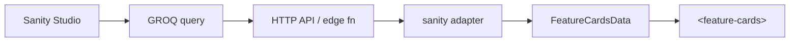

# Sanity integration cookbook

Use the **`sanity`** adapter to map GROQ query results onto feature cards — or
validate queries in Vision before wiring production `src`.

**Related:** [SCHEMA.md](../SCHEMA.md) · [DEMO.md](../DEMO.md) (schema playground)

## Data flow



## 1. Schema (Studio)

Example document type **`featureCard`**:

```javascript
// schemas/featureCard.js (illustrative)
export default {
  name: 'featureCard',
  type: 'document',
  fields: [
    { name: 'eyebrow', type: 'string' },
    { name: 'title', type: 'string', validation: (R) => R.required() },
    { name: 'description', type: 'text' },
    { name: 'statValue', type: 'string' },
    { name: 'statLabel', type: 'string' },
    { name: 'statTrend', type: 'string', options: { list: ['up', 'down', 'flat'] } },
    { name: 'ctaLabel', type: 'string' },
    { name: 'ctaUrl', type: 'url' },
    { name: 'theme', type: 'string' },
  ],
};
```

Match field names to what **`src/adapters/sanity.ts`** reads.

## 2. GROQ query

```groq
*[_type == "featureCard"] | order(_createdAt desc) {
  "id": _id,
  eyebrow,
  title,
  description,
  "figure": {
    "value": statValue,
    "label": statLabel,
    "trend": statTrend
  },
  "cta": {
    "label": coalesce(ctaLabel, title),
    "href": ctaUrl
  },
  theme
}
```

Run in **Vision** (Sanity Studio) until the result shape looks like an array
of card-like objects.

## 3. Expose via HTTP

### Sanity query API

```html
<feature-cards
  src="https://PROJECTID.api.sanity.io/v2021-06-07/data/query/production?query=ENCODED_GROQ"
  adapter="sanity"
  heading="From Sanity"
></feature-cards>
```

URL-encode the GROQ query parameter. For complex queries, prefer an edge
function that runs GROQ server-side and returns canonical JSON.

### Edge function pattern (recommended)

```js
// /api/cards — Cloudflare Worker, Vercel, etc.
import { createClient } from '@sanity/client';

const client = createClient({ /* projectId, dataset, apiVersion, token */ });
const result = await client.fetch(GROQ_QUERY);
return Response.json({ cards: result }); // or pass through sanity adapter
```

```html
<feature-cards src="/api/cards" adapter="sanity"></feature-cards>
```

Keeps tokens off the client and simplifies CORS.

## 4. Adapter input shapes

`sanity` adapter accepts:

| Input shape | Handling |
| --- | --- |
| `{ result: [...] }` | Sanity query API wrapper |
| Bare `[...]` array | Direct GROQ array result |
| Already canonical `{ cards }` | Pass through normalisation |

Read **`src/adapters/sanity.ts`** for edge cases.

## 5. Studio preview workflow

Before production wiring:

1. Run GROQ in **Vision**
2. Copy JSON result
3. Paste into demo **schema playground** (`npm run dev` → `#schema-playground`)
4. Fix field mismatches until preview renders
5. Encode query into `src` or edge function

This catches schema issues without deploy cycles.

## 6. CDN / static generation

For Gatsby/Next/Astro:

```js
// build time
const cards = await client.fetch(GROQ);
// write static JSON or set el.data at SSR
```

```html
<feature-cards adapter="generic" src="/cards.json"></feature-cards>
```

## 7. Theming & images

Add image fields to GROQ projection if needed:

```groq
"media": {
  "src": image.asset->url,
  "alt": coalesce(image.alt, "")
}
```

Ensure `alt` is empty string when decorative.

## 8. Troubleshooting

| Symptom | Fix |
| --- | --- |
| Empty result | Check `_type` filter and dataset (`production` vs `development`) |
| Adapter error | Compare Vision JSON to adapter expectations |
| CORS on direct API | Use same-origin edge proxy |
| Wrong locale | Sanity i18n — project fields per locale in GROQ |

[TROUBLESHOOTING.md](../TROUBLESHOOTING.md) · [FAQ.md](../FAQ.md)

## Checklist

- [ ] GROQ tested in Vision
- [ ] JSON validated in schema playground
- [ ] Token not exposed in browser (or accept risk on public dataset)
- [ ] `adapter="sanity"` matches response envelope
- [ ] Heading level fits page
