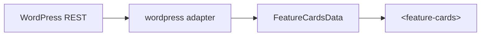

# WordPress integration cookbook

Embed `<feature-cards>` in classic themes, block themes (HTML templates), or
headless front-ends — **no JavaScript framework required**.

**Related:** [SCHEMA.md](../SCHEMA.md) · [TROUBLESHOOTING.md](../TROUBLESHOOTING.md) ·
[FAQ.md](../FAQ.md)

## Overview



| Approach | Best for |
| --- | --- |
| Script tag + inline JSON | Static marketing pages, hardcoded promos |
| `src` + REST | Editor-managed posts/custom post type |
| Imperative `createFeatureCards` | Theme PHP templates with dynamic targets |
| Light-DOM links | Maximum no-JS accessibility |

## 1. Enqueue the script

### CDN (fastest)

```php
// functions.php
add_action('wp_enqueue_scripts', function () {
  wp_enqueue_script(
    'feature-cards',
    'https://cdn.jsdelivr.net/npm/@humza/feature-cards@1.2/dist/feature-cards.iife.js',
    [],
    '1.2.0',
    true // footer
  );
});
```

### Self-hosted

Upload `feature-cards.iife.js` to your theme or media library and enqueue the
local URL. Pin version strings for cache busting.

### Subresource Integrity (recommended)

After each release, run locally:

```sh
npm run sri
```

Add the hash to your enqueue or inline script tag:

```html
<script
  src="https://cdn.jsdelivr.net/npm/@humza/feature-cards@1.2/dist/feature-cards.iife.js"
  integrity="sha384-…"
  crossorigin="anonymous"
  defer
></script>
```

Update cookbook pins when bumping `@humza/feature-cards` versions.

## 2. Render the element

### PHP template

```php
<section class="feature-cards-host">
  <feature-cards
    src="<?php echo esc_url(rest_url('wp/v2/feature-cards')); ?>"
    adapter="wordpress"
    heading="<?php esc_attr_e('Why teams choose us', 'my-theme'); ?>"
    heading-level="2"
    columns="3"
  ></feature-cards>
</section>
```

### Block theme (HTML template part)

```html
<feature-cards
  src="/wp-json/wp/v2/posts?_embed&categories=5"
  adapter="wordpress"
  heading="Latest features"
></feature-cards>
```

Ensure the REST route is **public** or authenticated via cookie/nonce strategy
appropriate to your site — the component uses browser `fetch`.

## 3. REST endpoint shape

The **`wordpress`** adapter expects WordPress REST post objects (array or
collection wrapper normalised by the adapter). Key fields:

| WP field | Maps to |
| --- | --- |
| `id` / slug | `card.id` |
| `title.rendered` | `card.title` |
| `excerpt.rendered` (stripped) | `card.description` |
| `link` | `card.cta.href` |
| `_embedded['wp:featuredmedia'][0].source_url` | `card.media.src` |
| ACF / meta (see adapter) | `eyebrow`, `figure`, custom CTA label |

Inspect **`src/adapters/wordpress.ts`** for the exact mapping (~40 lines).

### Custom post type

Register a `feature-cards` CPT with REST support, or reuse `posts` with a
category filter:

```
/wp-json/wp/v2/posts?_embed&categories=FEATURE_CATEGORY_ID
```

### `_embed` is important

Always include `_embed` when you need featured images — otherwise media fields
may be empty.

## 4. Imperative mount

Useful when the host element is rendered by PHP but options are dynamic:

```html
<div id="cards"></div>
<script type="module">
  import { createFeatureCards } from 'https://cdn.jsdelivr.net/npm/@humza/feature-cards@1.2/+esm';

  createFeatureCards({
    target: '#cards',
    src: '/wp-json/wp/v2/posts?_embed&categories=5',
    adapter: 'wordpress',
    heading: document.title,
    onReady: ({ count }) => console.log(`Rendered ${count} cards`),
    onError: (detail) => console.error(detail.issues),
  });
</script>
```

## 5. Progressive enhancement

For editors who want no-JS safety, output plain links inside the element:

```php
<feature-cards heading="Resources">
  <?php while ($q->have_posts()) : $q->the_post(); ?>
    <a href="<?php the_permalink(); ?>"
       data-eyebrow="<?php echo esc_attr(get_post_meta(get_the_ID(), 'eyebrow', true)); ?>"
       data-description="<?php echo esc_attr(get_the_excerpt()); ?>">
      <?php the_title(); ?>
    </a>
  <?php endwhile; ?>
</feature-cards>
```

JavaScript upgrades these into full cards; without JS, links still work.

## 6. Theming in WordPress

Set tokens on the host or a wrapper class in your theme CSS:

```css
.feature-cards-host feature-cards {
  --fc-accent: var(--wp--preset--color--primary);
  --fc-font: var(--wp--preset--font-family--system);
}
```

Do **not** attempt to style shadow internals directly — use `--fc-*` and
`::part()`. See [README § Theming](../../README.md#public-api).

## 7. Troubleshooting

| Issue | Fix |
| --- | --- |
| Empty cards | Check REST URL in browser; verify JSON array shape |
| No images | Add `_embed` to REST query |
| CORS on headless WP | Same-origin `src` or reverse proxy |
| Styling broken | Use `--fc-*` tokens, not theme element selectors |
| PHP block shows raw tag | Script must load — enqueue in `wp_enqueue_scripts` |

Full guide: [TROUBLESHOOTING.md](../TROUBLESHOOTING.md)

## 8. Custom adapter fork

If your ACF field names differ, **fork the adapter** in your theme/plugin as a
pre-processing step, or contribute a generalised mapping upstream. The component
only accepts canonical `FeatureCardsData` — transform before setting `el.data`:

```js
const res = await fetch('/wp-json/custom/v1/cards');
const data = await res.json();
document.querySelector('feature-cards').data = data; // already canonical
```

## Checklist

- [ ] IIFE or ESM loaded before custom element appears in DOM
- [ ] Version pinned + SRI on CDN
- [ ] REST endpoint tested in browser
- [ ] `_embed` for media
- [ ] `heading-level` matches page outline
- [ ] `--fc-*` tokens match brand (optional)
- [ ] `npm run canary:verify` if verifying AGPL deployment (optional)
