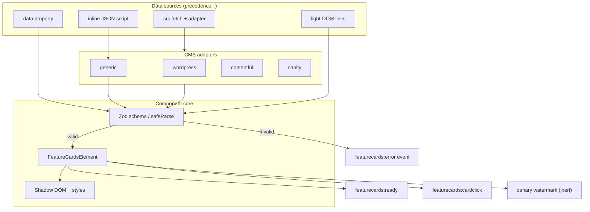

# Architecture diagram

High-level data and render flow for `<feature-cards>`.

```mermaid
flowchart TB
  subgraph sources["Data sources (precedence ↓)"]
    P["data property"]
    J["inline JSON script"]
    F["src fetch + adapter"]
    L["light-DOM links"]
  end

  subgraph adapters["CMS adapters"]
    G[generic]
    W[wordpress]
    C[contentful]
    S[sanity]
  end

  subgraph core["Component core"]
    Z["Zod schema / safeParse"]
    CE["FeatureCardsElement"]
    SD["Shadow DOM + styles"]
  end

  P --> Z
  J --> G --> Z
  F --> adapters --> Z
  L --> Z
  Z -->|valid| CE --> SD
  Z -->|invalid| E["featurecards:error event"]
  CE --> R["featurecards:ready"]
  CE --> K["featurecards:cardclick"]
  CE --> WM["canary watermark (inert)"]
```

See [ARCHITECTURE.md](../../ARCHITECTURE.md) and [docs/adr/](../adr/) for the written rationale.
