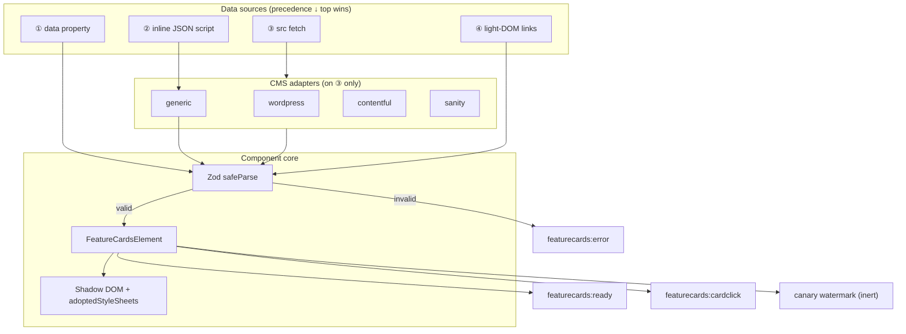
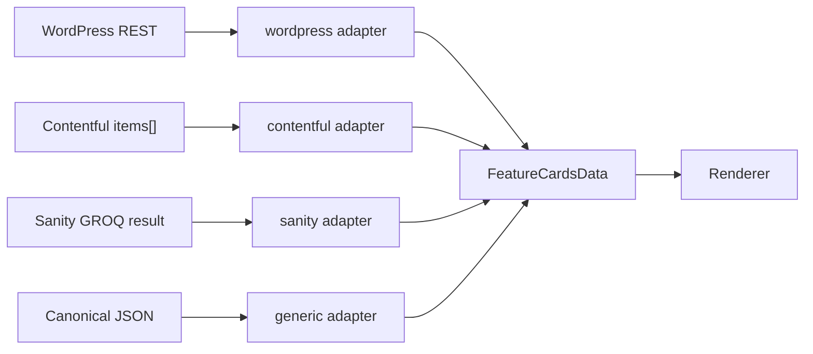
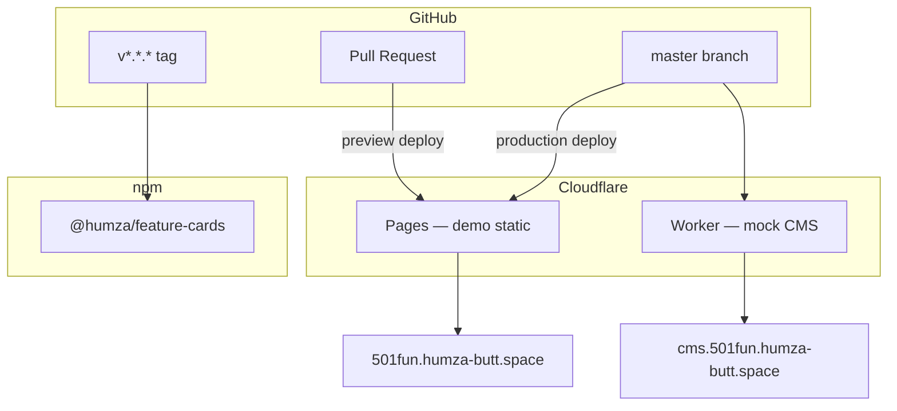
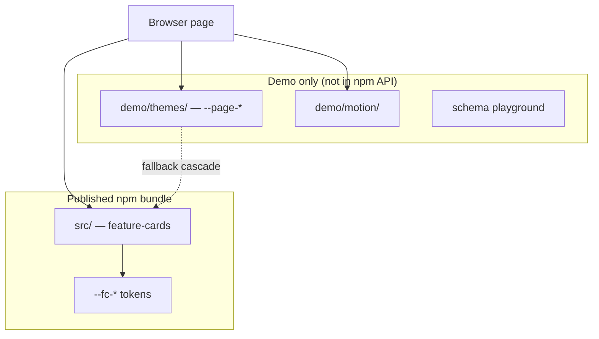
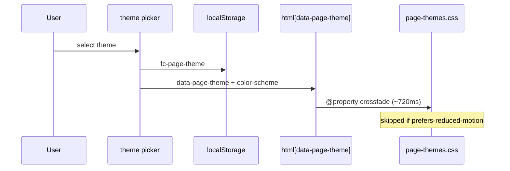
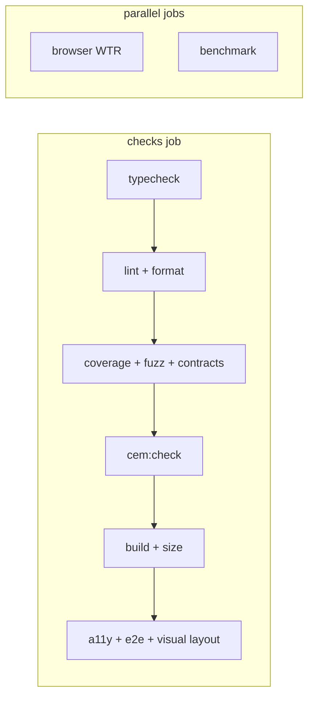

# Architecture diagrams

Visual companion to [ARCHITECTURE.md](../../ARCHITECTURE.md) and
[docs/adr/](../adr/). Mermaid renders on GitHub and most Markdown viewers.

## Data source precedence & render flow

## Adapter layer

## Deploy topology

## Demo vs shipped layers

## Theme & motion stack (demo)

## CI quality gates

## Related reading

| Topic | Document |
| --- | --- |
| Narrative architecture | [ARCHITECTURE.md](../../ARCHITECTURE.md) |
| Schema fields | [SCHEMA.md](../SCHEMA.md) |
| Demo themes | [DEMO.md](../DEMO.md) |
| ADRs | [docs/adr/](../adr/) |
